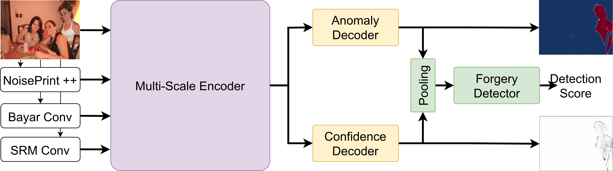

<div align="center"> 
    
## Exploring Multi-Modal Fusion for Image Manipulation Detection and Localization (MMM 2024)

</div>

[](https://paperswithcode.com/sota/image-manipulation-localization-on-casia-v1?p=exploring-multi-modal-fusion-for-image)
[](https://paperswithcode.com/sota/image-manipulation-detection-on-casia-v1?p=exploring-multi-modal-fusion-for-image)
[](https://paperswithcode.com/sota/image-manipulation-localization-on-cocoglide?p=exploring-multi-modal-fusion-for-image)
[](https://paperswithcode.com/sota/image-manipulation-detection-on-cocoglide?p=exploring-multi-modal-fusion-for-image)
[](https://paperswithcode.com/sota/image-manipulation-localization-on-columbia?p=exploring-multi-modal-fusion-for-image)
[](https://paperswithcode.com/sota/image-manipulation-detection-on-columbia?p=exploring-multi-modal-fusion-for-image)
[](https://paperswithcode.com/sota/image-manipulation-localization-on-coverage?p=exploring-multi-modal-fusion-for-image)
[](https://paperswithcode.com/sota/image-manipulation-detection-on-coverage?p=exploring-multi-modal-fusion-for-image)
[](https://paperswithcode.com/sota/image-manipulation-localization-on-dso-1?p=exploring-multi-modal-fusion-for-image)
[](https://paperswithcode.com/sota/image-manipulation-detection-on-dso-1?p=exploring-multi-modal-fusion-for-image)


Official implementation (code and trained models) of the MMM 2024 paper: "Exploring Multi-Modal Fusion for Image Manipulation Detection and Localization" (Arxiv ("submitted manuscript"): http://arxiv.org/abs/2312.01790)



## Datasets

Download train datasets:
- [Casiav2](https://github.com/namtpham/casia2groundtruth)
- [tampCOCO](https://github.com/mjkwon2021/CAT-Net#1-downloading-tampcoco--compraise)
- [IMD2020](http://staff.utia.cas.cz/novozada/db/)
- [FantasticReality](http://zefirus.org/articles/9f78c1e9-8652-4392-9199-df1b6a6c1a3d/)

Download test datasets:
- [Casiav1](https://github.com/namtpham/casia1groundtruth)
- [corel](https://www.kaggle.com/datasets/elkamel/corel-images)
- [CocoGlide](https://github.com/grip-unina/TruFor#cocoglide-dataset)
- [Columbia](https://www.ee.columbia.edu/ln/dvmm/downloads/authsplcuncmp/)
- [COVER](https://github.com/wenbihan/coverage)
- [DSO-1](https://recodbr.wordpress.com/code-n-data/#dso1_dsi1)

The corel dataset is needed to create the Casiav1+ dataset.

The data lists for the test sets are split into manipulated and authentic
images and are present in the files named:
```bash
./data/IDT-<DATASET_NAME>-manip.txt
./data/IDT-<DATASET_NAME>-auth.txt
```
This is intended for ease of use when evaluating for localization, where
you only use manipulated images (localization F1 for authentic images is 
always 0!).

The data lists for training are split into train and val files for ease of
use and reproducibility. We use the train-validation split proposed by 
Kwon et al. in [CAT-Net](https://github.com/mjkwon2021/CAT-Net).
Train data lists are in files named:
```bash
./data/CAT-Net_splits/train/<DATASET_NAME>.txt
./data/CAT-Net_splits/val/<DATASET_NAME>.txt
```
For our experiments we validated on a validation split of our training 
datasets so the testing datasets remained completely unseen until evaluation.

### Data folder structure

Then you should place the datasets in the data directory as such:
```
data/
├── Casiav1
│   ├── Au
│   ├── Gt
│   └── Tp
├── Casiav2
│   ├── Au
│   ├── mask
│   └── tampered
├── CocoGlide
│   ├── fake
│   ├── mask
│   └── real
├── Columbia
│   ├── 4cam_auth
│   └── 4cam_splc
├── compRAISE
│   └── <all images here>
├── corel-1k
│   ├── test_set
│   └── training_set
├── COVER
│   ├── Au
│   ├── mask
│   └── tampered
├── DSO-1
│   ├── images
│   └── masks
├── FantasticReality
│   ├── ColorFakeImages
│   ├── ColorRealImages
│   └── masks
├── IMD2020
│   ├── 1a1ogs
│   ├── 1a3oag
│       .
│       .
│       .
│   └── z41
└── tampCOCO
    └── <all images here>
```

## Training
### Preparation
Before training, you need to download the pretrained networks following the instructions [here](pretrained/README.md) and place them in the <root>/pretrained directory as:
```
pretrained/
├── segformer
├── noiseprint
└── modal_extractor
```

### Experiment Settings
Before training, you need to create an experiment file and place it in the
'experiments' folder. This yaml file contains parameters for training. To train
a model with our training settings you can use the ec_example.yaml file provided.
You can however change training parameters as follows:
- You can change the learning parameters
if needed or train for more epochs:
```yaml
WORKERS: 16
ACCUMULATE_ITERS: 6
BATCH_SIZE: 4
WARMUP_EPOCHS: 2
EPOCHS: 100
```
- You can change the optimizer or scheduler parameters:
```yaml
LEARNING_RATE: 0.005
SGD_MOMENTUM: 0.9
WD: 0.0005
POLY_POWER: 0.9
```

- You can change the train or validation datasets:
```yaml
DATASET:
  TRAIN:
    - 'data-list-1'
    - ...
    - 'data-list-N'
  VAL:
    - 'val-data-list-1'
    - ...
    - 'val-data-list-N'
```

### Localization Training
After that you can run an example training by:

```bash
example_train.sh
```
You can change the training parameters by creating a new experiment yaml file in the <root>/experiments directory.
The checkpoint is saved as:
```
ckpt/
└── <model_name>
    ├── best_val_loss.pth
    └── final.pth
```
The model_name parameter is set in the experiment yaml file as:
```yaml
MODEL:
  NAME: <model_name>
```
### Detection Training
To run detection training (phase 2) you need a localization checkpoint (produced from phase 1 training) placed in the chekpoints folder. 
If you want to use one of our localization checkpoints you can download them following the instructions [here](ckpt/README.md).

The experiment file for phase 2 training should be set for detection as:
```yaml
MODEL:
  TRAIN_PHASE: 'detection'
```
Then you can train a model for detection and evaluate on our testing datasets as follows:
```bash
source data.sh
exp='./experiments/ec_example_phase2.yaml'
ckpt_loc='./ckpt/<path_to_localization_ckpt>'
ckpt='./ckpt/<model_name>/best_val_loss.pth'
$pint ec_train_phase2.py --ckpt $ckpt_loc --exp $exp

$pint test_detection.py --exp $exp --ckpt $ckpt --manip $columbia_manip --auth $columbia_auth
$pint test_detection.py --exp $exp --ckpt $ckpt --manip $cover_manip --auth $cover_auth
$pint test_detection.py --exp $exp --ckpt $ckpt --manip $dso1_manip --auth $dso1_auth
$pint test_detection.py --exp $exp --ckpt $ckpt --manip $cocoglide_manip --auth $cocoglide_auth
$pint test_detection.py --exp $exp --ckpt $ckpt --manip $casiav1_manip --auth $casiav1_auth
```

## Evaluation
You can download our pretrained networks following the instructions [here](ckpt/README.md) and place them in the <root>/ckpt directory.
Then you can evaluate a model for localization by using:
```bash
example_test.sh
```
and changing the relevant parameters, or more analytically:
```bash
source data.sh
exp='./experiments/ec_example.yaml'
ckpt='./ckpt/<model_name>/best_val_loss.pth'

$pint test_localization.py --exp $exp --ckpt $ckpt --manip $columbia_manip
$pint test_localization.py --exp $exp --ckpt $ckpt --manip $cover_manip
$pint test_localization.py --exp $exp --ckpt $ckpt --manip $dso1_manip
$pint test_localization.py --exp $exp --ckpt $ckpt --manip $cocoglide_manip
$pint test_localization.py --exp $exp --ckpt $ckpt --manip $casiav1_manip
```
In the same way you can evaluate a model for detection:
```bash
source data.sh
exp='./experiments/ec_example_phase2.yaml'
ckpt='./ckpt/<model_name>/best_val_loss.pth'

$pint test_detection.py --exp $exp --ckpt $ckpt --manip $columbia_manip --auth $columbia_auth
$pint test_detection.py --exp $exp --ckpt $ckpt --manip $cover_manip --auth $cover_auth
$pint test_detection.py --exp $exp --ckpt $ckpt --manip $dso1_manip --auth $dso1_auth
$pint test_detection.py --exp $exp --ckpt $ckpt --manip $cocoglide_manip --auth $cocoglide_auth
$pint test_detection.py --exp $exp --ckpt $ckpt --manip $casiav1_manip --auth $casiav1_auth
```

## License
This code is provided for academic, non-commercial use only. Please also check for any restrictions applied in the code parts and datasets used here from other sources. For the materials not covered by any such restrictions, redistribution and use in source and binary forms, with or without modification, are permitted for academic non-commercial use provided that the following conditions are met:

Redistributions of source code must retain the above copyright notice, this list of conditions and the following disclaimer. Redistributions in binary form must reproduce the above copyright notice, this list of conditions and the following disclaimer in the documentation provided with the distribution. 

This software is provided by the authors "as is" and any express or implied warranties, including, but not limited to, the implied warranties of merchantability and fitness for a particular purpose are disclaimed. In no event shall the authors be liable for any direct, indirect, incidental, special, exemplary, or consequential damages (including, but not limited to, procurement of substitute goods or services; loss of use, data, or profits; or business interruption) however caused and on any theory of liability, whether in contract, strict liability, or tort (including negligence or otherwise) arising in any way out of the use of this software, even if advised of the possibility of such damage.

## Acknowledgements
This work was supported by the EU's Horizon 2020 research and innovation programme under grant agreement H2020-101021866 CRiTERIA.


Thanks to the public repositories:
- [DELIVER](https://github.com/jamycheung/DELIVER)
- [TruFor](https://github.com/grip-unina/TruFor)
- [CAT-Net](https://github.com/mjkwon2021/CAT-Net)

## Citation
If you find our method useful in your work or you use some materials provided in this repo, please cite the following publication where our method and materials were presented: 

````
@inproceedings{triaridis2024exploring,
    title={Exploring Multi-Modal Fusion for Image Manipulation Detection and Localization},
    author={Triaridis, Konstantinos and Mezaris, Vasileios},
    year={2024},
    month={Jan.-Feb.},
    booktitle={Proc. 30th Int. Conf. on MultiMedia Modeling (MMM 2024)}
}
````

Arxiv ("submitted manuscript") version accessible at: http://arxiv.org/abs/2312.01790
